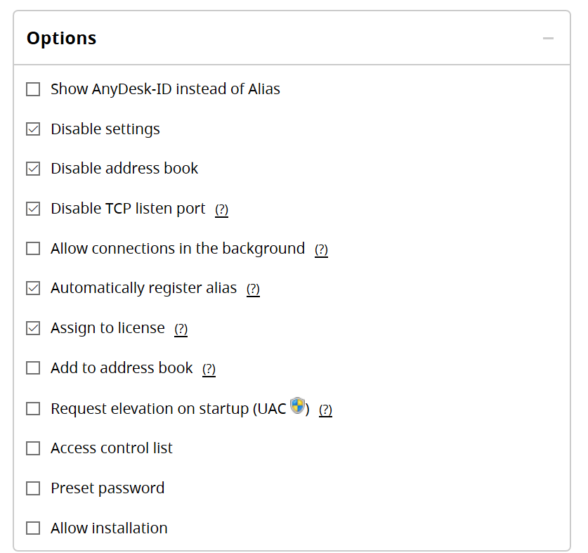
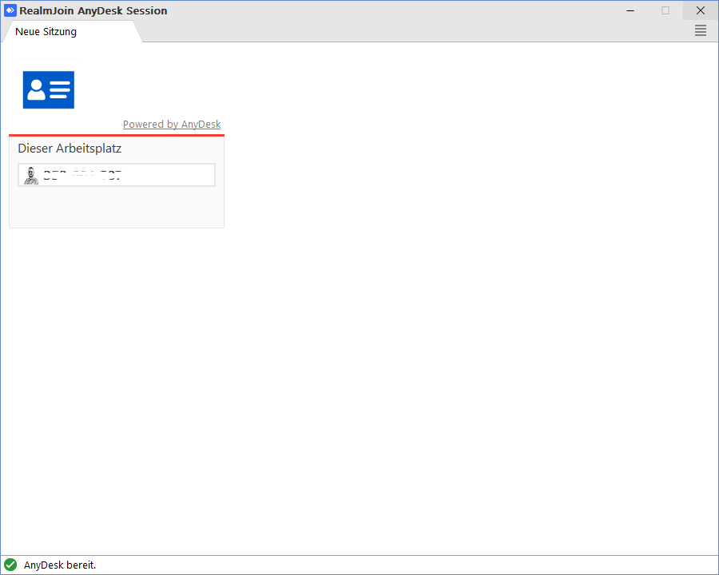
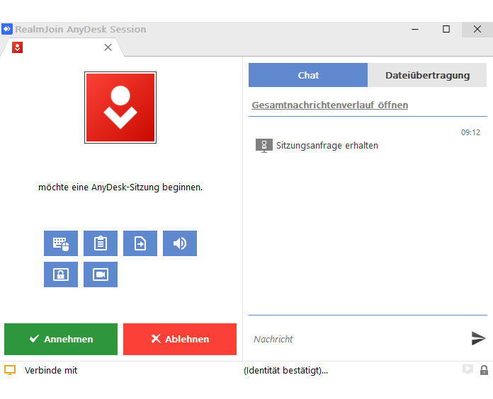

# AnyDesk

The RealmJoin Enterprise License contains an single session licens of the remote desktop tool **AnyDesk**. It allows the access to client devices including the option to elevate rights by using the RealmJoin LAPS feature. AnyDesk can be installed on Windows, macOS, Linux, mobile devices and Raspberry Pi as well.

AnyDesk uses ID numbers to establish connections between two computers. Share your ID number with an other user \(this user needs AnyDesk as well\). This user has to enter the ID number in the AnyDesk menu. When you accept the request, the other user will have access to your desktop.

RealmJoin skips the whole ID number sharing process, because every AnyDesk ID numbers in an organization are linked to single users. An Administrator just needs to know the user and can request for access to the computer. Still the user has to accept this request.


When you use the AnyDesk feature \(via RealmJoin\), it is not possible to start a remote session with external AnyDesk users.


## AnyDesk deployment

Before you can start with a AnyDesk session, you have to do few settings.

| Task | Image |
| :--- | :--- |
| 1. Log in to [AnyDesk](https://my.anydesk.com/login) |  |
| 2. Customize your AnyDesk client |  |
| 3. Select **Make download link publicly available** |  |
| 3. Click **Save** to confirm your settings |  |
| 4. The **Custom Client Details** page will appear |  |
| 5. Select the following **Options**: |  |
| - Disable Settings |  |
| - Disable address book |  |
| - Disable TCP listen port |  |
| - Automatically register alias |  |
| - Assign to license |  |
| 6. Copy or save the **Public Download** URL. You need it for **AnyDesk Group Settings** |  |

## AnyDesk Group Settings

Use a JSON policy to configure AnyDesk in RealmJoin backend \(**Group Settings**\). There are three different policies to configure AnyDesk.

The following JSON contains all configurations:

**Key** = Integration  
**Value** = {"AnyDesk: { "Enabled": true, "BootstrapperUrl": "[https://.../.../AnyDesk.exe](https://.../.../AnyDesk.exe)", "Ui": {TrayMenuTextEnglish": "Start remote session} } }


The BootstrapperUrl is your **Public Download Url** from AnyDesk Custom Client Details.


It is also possible to split this single JSON from above, in three different JSON policies:

**Key** = Integration.AnyDesk.Enabled  
**Value** = true

and

**Key** = Integration.AnyDesk.BootstrapperUrl  
**Value** = "[https://.../.../AnyDesk.exe](https://.../.../AnyDesk.exe)"

and

**Key** = Integration.AnyDesk.UI.TrayMenuTextEnglish  
**Value** = "Start remote session"

The following JSON is possible as well:

**Key** = Integration.AnyDesk  
**Value** = {"Enabled":true, BootstrapperUrl": "[https://.../.../AnyDesk.exe](https://.../.../AnyDesk.exe)", "UI":{"TrayMenuTextEnglish": "Start remote session"} }

## Backend Integration

After you customize your Client, AnyDesk will send you an email. This mail contains your **Contract ID**, your **License ID** and your **API Password**. Send these IDs and the password to the [Glück & Kanja support](mailto:support@glueckkanja.com). If you do so, Glück & Kanja will integrate a AnyDesk API in your RealmJoin Portal.

## Start a remote session via RealmJoin tray menu

| Task | Image |
| :--- | :--- |
| 1. Open the RealmJoin tray menu |  |
| 2. Click **Start remote session** |  |
| 3. The AnyDesk client starts and its current address will be pushed to RealmJoin backend in background. In addition, its visible in the UI. |  |
| 4. This client address will be displayed in RealmJoin portal at the corresponding client and the support staff can initiate the session via clicking **Connect** |  |
| 5. This will automatically start the AnyDesk client |  |
| 6. Subsequently, the end user needs to accept the incoming remote session request |  |
| 7. The Connection is established and the support staff can perform his tasks remotely |  |
| 8. When the job is finished, please **disconnect** from the remote session |  |

### Get elevated rights

For special support scenarios administrative rights will be needed. A normal remote session starts with standard rights. That requires to elevate the permissions:

| Task | Image |
| :--- | :--- |
| 1. Click the **lightning icon** |  |
| 2. Select **Request elevation** |  |
| 3. In the new appearing window \(Request elevation\) choose **Transmit authentication data** |  |
| 4. Insert corresponding credentials |  |
| 5. Then, click **OK** |  |
| 5. On the remote client, a new window **User Account Control** will appear |  |
| 6. Confirm it |  |
| 7. The support staff is now able to perform administrative tasks. |  |

