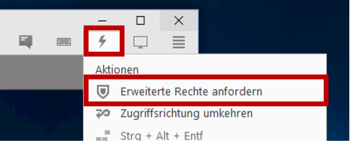

# Customer Tasks

If you are interested in AnyDesk send a request to [Glück & Kanja \(GK\)](mailto:support@glueckkanja.com). GK sends you a URL. This URL is important for the following configurations and settings.

## AnyDesk Group Settings

Use a [JSON policy](../../packages/json-backgrounder.md) to configure AnyDesk in the RealmJoin [Group Settings](../../rj-portal/groups-and-group-settings.md#group-settings). There are three different policies to configure AnyDesk.

The following JSON contains all configurations:

**Key** = Integration  
**Value** = {"AnyDesk: { "Enabled": true, "BootstrapperUrl": "[https://.../.../AnyDesk.exe](https://.../.../AnyDesk.exe)", "Ui": {TrayMenuTextEnglish": "Start remote session} } }


The BootstrapperUrl is your **Public Download Url** from AnyDesk Custom Client Details.


It is also possible to split this single JSON from above, in three different JSON policies:

**Key** = Integration.AnyDesk.Enabled  
**Value** = true

and

**Key** = Integration.AnyDesk.BootstrapperUrl  
**Value** = "[https://.../.../AnyDesk.exe](https://.../.../AnyDesk.exe)"

and

**Key** = Integration.AnyDesk.UI.TrayMenuTextEnglish  
**Value** = "Start remote session"

The following JSON is possible as well:

**Key** = Integration.AnyDesk  
**Value** = {"Enabled":true, BootstrapperUrl": "[https://.../.../AnyDesk.exe](https://.../.../AnyDesk.exe)", "UI":{"TrayMenuTextEnglish": "Start remote session"} }

## Back-End Integration

After you configure your Client, AnyDesk will send you an email. This email contains your **Contract ID**, your **License ID** and your **API Password**. Send these IDs and the password to the [Glück & Kanja suppor](mailto:support@glueckkanja.com)t. If you do so, GK will integrate a AnyDesk API in your RealmJoin portal.

### AnyDesk Service Module

To allow a supporter to connect to a desktop, you have to assign the AnyDesk SM package to a supporter.

Read our [App Store article](../../rj-portal/app-store.md#app-subscribtion) for details about package subscription and read our [Software Packages article](../../rj-portal/software-packages.md#package-assignment) for details about package assignment.

## Start a Remote Session via RealmJoin Tray Menu

| Task | Image |
| :--- | :--- |
| 1. Open the RealmJoin tray menu |  |
| 2. Click **Start remote session** |  |
| 3. The AnyDesk client starts and its current address will be pushed to RealmJoin backend in the background. Also,, it's visible in the UI. |  |
| 4. This client address will be displayed in RealmJoin portal at the corresponding client and the support staff can initiate the session via clicking **Connect** |  |
| 5. This will automatically start the AnyDesk client |  |
| 6. Subsequently, the end user needs to accept the incoming remote session request |  |
| 7. The Connection is established and the support staff can perform his tasks remotely |  |
| 8. When the job is finished, please **disconnect** from the remote session |  |

#### Get Elevated Rights

For special support scenarios, administrative rights will be needed. A normal remote session starts with standard rights. That requires to elevate the permissions:

| Task | Image |
| :--- | :--- |
| 1. Click the **lightning icon** |  |
| 2. Select **Request elevation** |  |
| 3. In the new appearing window \(Request elevation\) choose to **Transmit authentication data** |  |
| 4. Insert corresponding credentials |  |
| 5. Then, click **OK** |  |
| 5. On the remote client, a new window **User Account Control** will appear |  |
| 6. Confirm it |  |
| 7. The support staff is now able to perform administrative tasks. |  |

