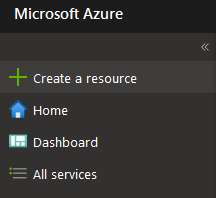
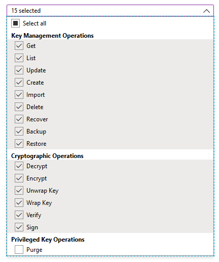

# KeyVault

Cloud applications and services use cryptographic keys and secrets to help keep information secure. Azure Key Vault safeguards these keys and secrets. When you use Key Vault, you can encrypt authentication keys, storage account keys, data encryption keys, .pfx files, and passwords by using keys that are protected by hardware security modules.

## Create KeyVault

The following table shows you the steps for Azure KeyVault Creation:

| Task | Image |
| :--- | :--- |
| 1. Open [Azure Portal](https://portal.azure.com) |  |
| 2. Start with **Create a resource** |  |
| 3. In the search field type in **Key Vault** and conform with enter |  |
| 4. On the detail page click **Create** |  |
| 5. **Name**, **Subscription**, **Resource Group** and **Location** are required fields |  |
| 6. Conform with **Create** an wait for successful deployment |  |
| 7. Open the recently created Key Vault |  |
| 8. Click **Add new** to add a new access policy |  |
| 9. Select **Key, Secret & Certificate Management** as template and add **RealmJoin** as principal |  |
| 10. For **Cryptographic Operations** add Decrypt, Encrypt, Unwrap Key, Wrap Key, Verify and Sign |  |
| 11. Confirm with **Ok** and **Save** |  |
| 12. Finally, go to **Overview** and share the **DNS Name** with the [Glück & Kanja support](mailto:product.support@glueckkanja.com) |  |
| **Example Value**: [https://contoso-rj-laps.vault.azure.net/](https://contoso-rj-laps.vault.azure.net/) |  |

## KeyVault Storage of Secrets

RealmJoin will not store the secret in any proprietary storage but instead create an **Azure KeyVault Secret** to store it in a secure and auditable way. The KeyVault API is documented here:

[https://docs.microsoft.com/en-us/rest/api/keyvault/setsecret/setsecret](https://docs.microsoft.com/en-us/rest/api/keyvault/setsecret/setsecret)

The entry in KeyVault will be added with the device name as a key and the plain GUID as the secret value. See the following example screenshot:

