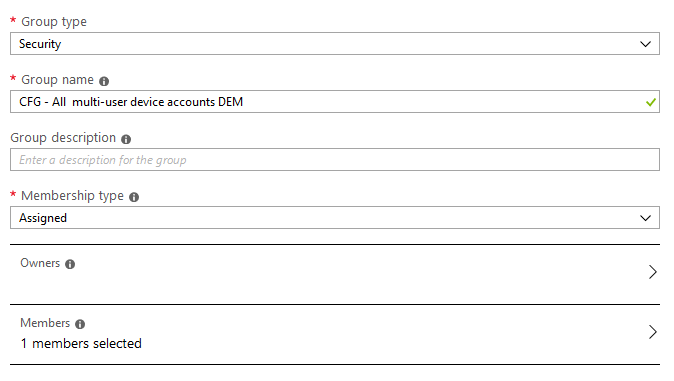
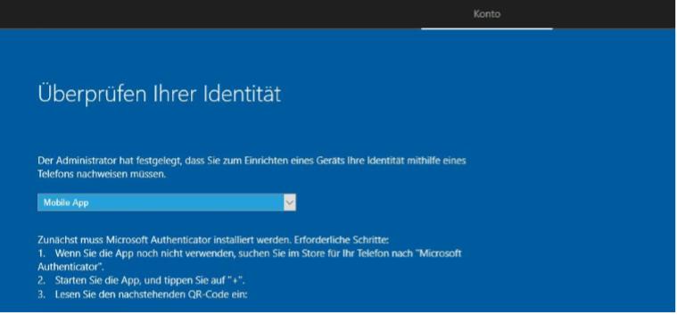
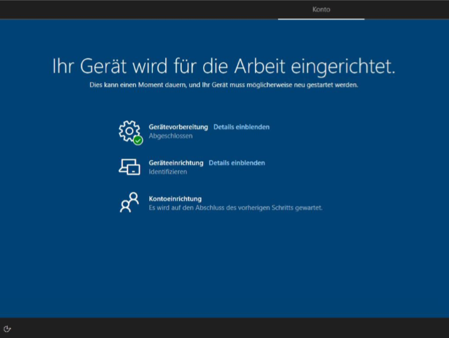
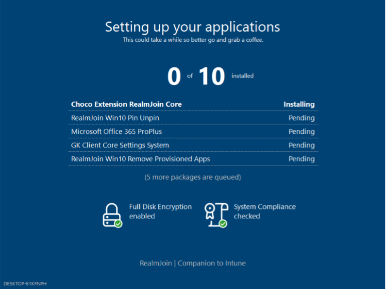
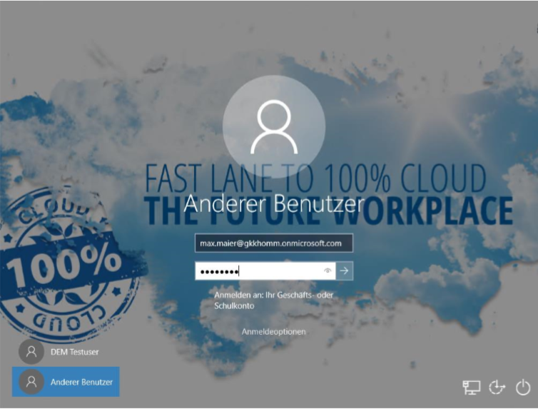
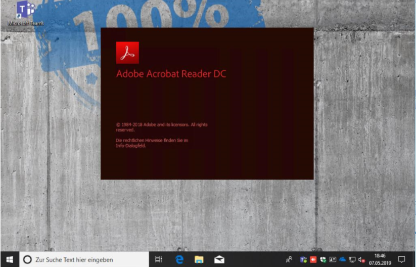

# Multi-User Devices

Multi-User Devices allow an administrator to provision devices intended to be used by more than one user. A tool for Multi-User Devices is **Device Enrollment Manager** (short DEM).

DEM is an Intune permisson that can be applied to an Azure Active Directory user account and lets the user enroll up to 1,000 devices. A DEM account is useful for scenarios where devices are enrolled and prepared before handing them out to the users of the devices.

## Licenses

Devices enrolled by DEM accounts need to be licensed. Therefore, each DEM account needs an Intune user or device license assigned.

Example:

- Enterprise Mobility + Security (user license) or
- A simple device license

## Preparations

Before you can start with a device enrollment you have to do some preparations.

### Create DEM User

Create a generic user account that is not assigned to a real person. Please make sure that this account never gets deleted. In that case, enrolled devices will not stay under management any more. Assign a suitable Intune license as described before.

### Create User Group for DEM Accounts

A new user group is necessary that contains all DEM users. Ad one (e.g. **CFG - All multi-user device accounts DEM**) and assign the previously created user.

### Prepare Group

In **Intune** the following doings are necessary for that group:

- Assign compliance policies and device configurations (that should apply for these devices)
- Assign Intune distributed apps (e. g. RealmJoin Installer)
- Check if DEM group is able to enroll and register new devices in Tune/Azure AD (e. g. enrollment restrictions and Azure AD Join)

The following steps must be done in **RealmJoin**

- Add RealmJoin configuration policies to that group
- Add Software packages (that should be installed when device is set up by DEM account)
- Let Glück & Kanja mark this group as **Primary Users** (obtain Azure AD Object ID)

### Software Packages

Packages that should be installable by secondary users (in addition to packages installed by DEM account) must have the following setting (assigned to a group with secondary users):

If this setting is not set, such packages cannot be installed by secondary users (because of the default value: **Only primary**)

> [!NOTE]
> Software Packages of secondary users will also get updates, even when these packages were installed by a primary user.

## Device Setup

A new and clean device will be set up with the DEM user account created before:

[

Depending on configuration second factor authentication will be enforced:

Device enrollment and provisioning will start:

Prompt for Windows Hello setup appears (depending on configuration):

After that, RealmJoin will start and install the defined set of software for the DEM account:

When logging in via DEM account (primary user) the software should be installed:

## Secondary User Experience

Secondary users are now able to log in::

Software assigned and installed by DEM account should be available

Additional software can be installed by this secondary user (see **Software Packages**):

