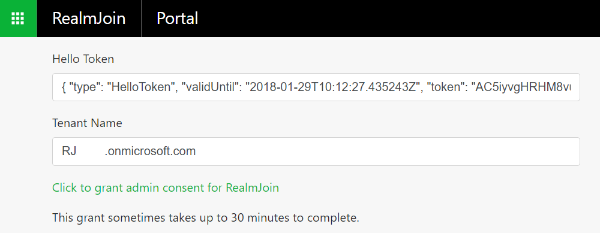
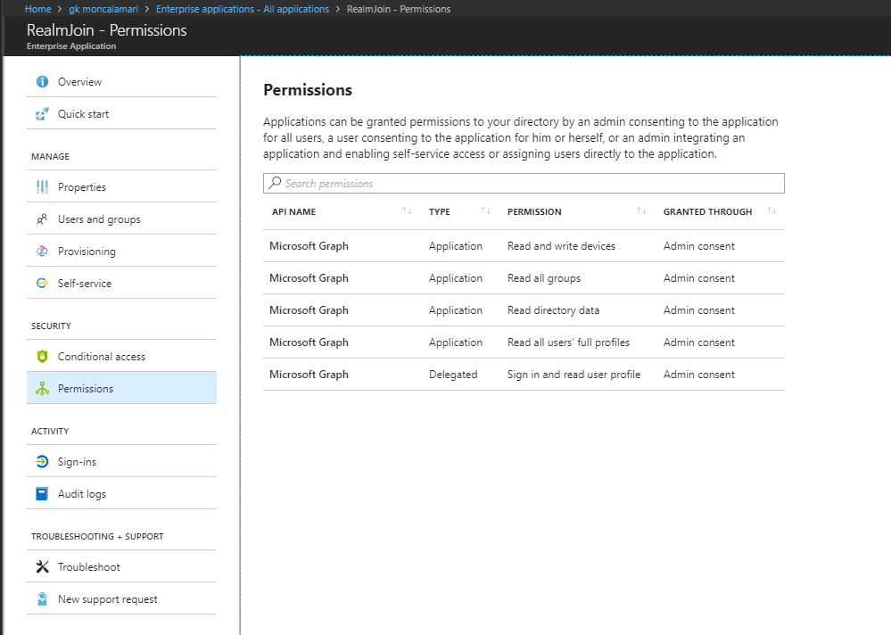

# Installation

RealmJoin can be deployed on a device using one of multiple ways, depending on the individual scenario. As a first step, download the RealmJoin installer of your choice and precede to the desired installation method.

Stable release: [RealmJoin Release Version](https://gkrealmjoin.s3.amazonaws.com/win-release/RealmJoin.msi)

Beta Channel \(near to stable, for long time testing\): [RealmJoin Beta Version](https://gkrealmjoin.s3.amazonaws.com/win-beta/RealmJoin.msi)

Canary Channel \(Experimental, first testing\): [RealmJoin Canary Version](https://gkrealmjoin.s3.amazonaws.com/win-canary/RealmJoin.msi)

## Front-end \(Client\)

The front-end component of RealmJoin is a RealmJoin client, which is installed on the Windows 10 device. With the installed RealmJoin client an individual user is able to access and install provided software in self service. Packages assigned as **required** by the administrator are installed automatically on the first Logon after assignment. RealmJoin is responsible for two different processes running on the device:

* The **realmjoin.exe** process is started up automatically on Logon. The process is always running and sends upstream data \(compare to chapter [RealmJoin Portal](rj-portal.md#States) every 15 minutes.
* The **realmjoinservice.exe** is called when a package requires the **SYSTEM mode** to be processed. It is not running by default.

## Pre-Requirements

The following pre-requirements are necessary for RealmJoin:

* Microsoft Azure with Azure AD
* Windows 10
* Microsoft Intune

RealmJoin runs on every Windows 10 device. A Windows 10 certified device with TPM chip is recommended to ensure BitLocker initialization.

## Installation via Microsoft Intune

RealmJoin has to deploy through Microsoft Intune by deploying the MSI as a Line-of-Business app.

### Azure Intune Portal

The deployment of RealmJoin using Intune requires only the .MSI installer to be configured. If the RealmJoin app in the desired release version is not registered in Intune, it can be added as a Line-of-Business app via the Azure Portal blades:

1. Navigate to **Intune**
2. Click **Client Apps**
3. Click **Apps**
4. Then click **Add**

[](https://github.com/realmjoin/realmjoin-gitbooks/tree/3c2250fcc0d712e1b40ac535a1766b57ce01910c/docs/media/rj-intune-deploy.png)

In the configuration tab basic and advanced information can be provided.

[](https://github.com/realmjoin/realmjoin-gitbooks/tree/3c2250fcc0d712e1b40ac535a1766b57ce01910c/docs/media/rj-intune-deploy2.png)

> \[!NOTE\] Like any other application in Intune, ReamJoin then can be assigned to the desired user groups as \(required\) software. It is not necessary to install additional software on the client devices to run RealmJoin. RealmJoin will be deployed on the client devices on next Azure sync.

### Windows Defender Exceptions

RealmJoin might be recognized by **Windows Defender** as a possible threat. While this behaviour is not certain, it is recommended to implement some Windows Defender exceptions. Create a new device configuration profile, type **Device restriction**, or edit your existing profile and add the following **Windows Defender Antivirus Exceptions**:

* Files and folders  
  * `%ProgramFiles%\RealmJoin`  
* Processes
  * `%ProgramFiles%\RealmJoin\RealmJoin.exe`
  * `%ProgramFiles%\RealmJoin\RealmJoinService.exe`
  * `%ProgramFiles%\RealmJoin\RealmJoinUpdate.exe`

## Interactive Installation

If an administrator wants to install RealmJoin on a device without mass deployment or the Microsoft Intune infrastructure, he/she may download the MSI and do an interactive installation or copy one of the command lines below to download and run in a single step.

### Command Line Installation

You may download and install RealmJoin in a single step by using the following command lines. This may help especially when testing scenarios or new software packages in virtual machines.

Release Channel:

```text
@powershell -NoProfile -ExecutionPolicy unrestricted -Command "((new-object net.webclient).DownloadFile('https://gkrealmjoin.s3.amazonaws.com /win-release/RealmJoin.exe', 'realmjoin.exe'))" && .\realmjoin.exe
```

Beta Channel:

```text
@powershell -NoProfile -ExecutionPolicy unrestricted -Command "((new-object net.webclient).DownloadFile('https://gkrealmjoin.s3.amazonaws.com
/win-beta/RealmJoin.exe', 'realmjoin.exe'))" && .\realmjoin.exe
```

Canary Version:

```text
@powershell -NoProfile -ExecutionPolicy unrestricted -Command "((new-object net.webclient).DownloadFile('https://gkrealmjoin.s3.amazonaws.com
/win-canary/RealmJoin.exe', 'realmjoin.exe'))" && .\realmjoin.exe
```

### Silent Installation

When installing RealmJoin during unattended OS installation or any other non-interactive deployment method you may favour not to have any UI interaction during installation. To install RealmJoin in such a scenario use the silent installation option:

```text
reamjoin.exe -install
```

## Connecting a tenant with RealmJoin

To a connect a tenant to the Glück & Kanja RealmJoin back-end, a **Hello Token** is needed. This token might be requested from Glück & Kanja. A RealmJoin administrator group has to be created upfront in AAD with the name **cfg-RealmJoin Admin** and all dedicated RealmJoin administrators should be added to it. The **Connect Wizard** is located under the URL [RealmJoin connect](https://realmjoin-web.azurewebsites.net/global/graph). The token and the tenant name are to be entered and the request submitted.

[](https://github.com/realmjoin/realmjoin-gitbooks/tree/3c2250fcc0d712e1b40ac535a1766b57ce01910c/docs/media/rj-connect-tenant.png)

A tenant administrator has to give consent to RealmJoin. The Connect Wizard creates the necessary entries in Intune. After the success, it is important to revisit the first tab/browser window and the **Check&Install** option as to be executed.

### RealmJoin Permissions

The following permissions are admitted by the administrator consent and set in Azure via the GraphAPI:

[](https://github.com/realmjoin/realmjoin-gitbooks/tree/3c2250fcc0d712e1b40ac535a1766b57ce01910c/docs/media/rj-realmjoin-permissions.png)

### Default software for new tenants

After successful connection the following software packages are provided as default in RealmJoin portal:

* Choco Extension RealmJoin Core
* Google Chrome
* Microsoft Office 365 ProPlus
* Microsoft Teams
* Mozilla Firefox
* RealmJoin Core Extension
* RealmJoin Win10 Core Settings System
* RealmJoin Win10 Remove Suggested Apps
* RealmJoin Win10 Update Start Layout
* RealmJoin Win10 Pin Unpin
* RealmJoin Win10 Remove Provisioned Apps
* Generic RealmJoin Configure OneDrive
* Genereic Windows Activation
* MS Office with user settings and proofing tools  
* 7-Zip
* GlueckKanja RealmJoin Publish State Computer System Information
* GlueckKanja RealmJoin Publish State Speculation Control Settings

In addition, the following policies are part of a tenant for all RJ Users:

* Environment.Channel \(beta\)
* Integration.AnyDesk
* LocalAdminManagement
* Policies.ExplorShortcuts
* Policies.DisableNetworkLocationWizard
* WebLinks

