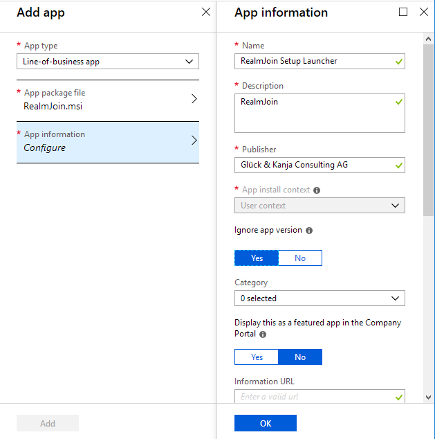

# Install Using Microsoft Intune

RealmJoin has to deploy through Microsoft Intune by deploying the MSI as a Line-of-Business app.

### Azure Intune Portal

The deployment of RealmJoin using Intune requires only the .MSI installer to be configured. If the RealmJoin app in the desired release version is not registered in Intune, it can be added as a Line-of-Business app via the Azure Portal blades:

1. Navigate to **Intune**
2. Click **Client Apps**
3. Click **Apps**
4. Then click **Add**

In the configuration tab basic and advanced information can be provided.


Like any other application in Intune, ReamJoin can be assigned to the desired user groups as \(required\) software. It is not necessary to install additional software on the client devices to run RealmJoin. RealmJoin will be deployed on the client devices on the next Azure sync.


### Windows Defender Exceptions

RealmJoin has worked with the Microsoft Defender Team to be whitelisted from malware detection. Since Defender is using more and more machine learning mechanisms to identify potential threats and RealmJoin has several features like cloud downloaded application installations,  RealmJoin might be recognized by **Windows Defender** as a possible threat. While this behavior is not certain, it is recommended to implement additional Windows Defender exceptions. Create a new device configuration profile, type **Device restriction**, or edit your existing profile and add the following **Windows Defender Antivirus Exceptions**:

| Defender Exceptions |
| :--- |
| **Files and Folders** |
| `%ProgramFiles%\RealmJoin` |
| **Processes** |
| `%ProgramFiles%\RealmJoin\RealmJoin.exe`  |
| `%ProgramFiles%\RealmJoin\RealmJoinService.exe`  |
| `%ProgramFiles%\RealmJoin\RealmJoinUpdate.exe` |

