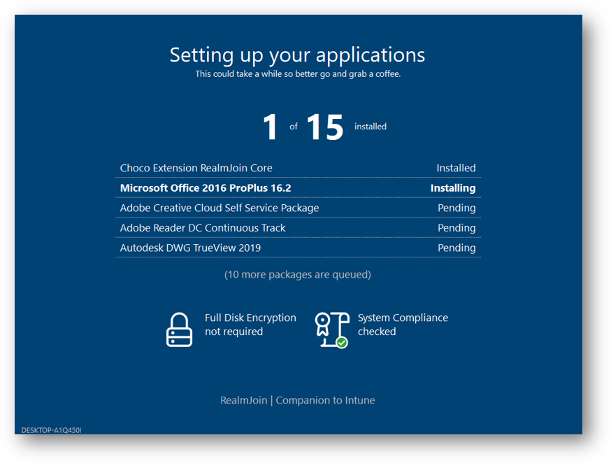
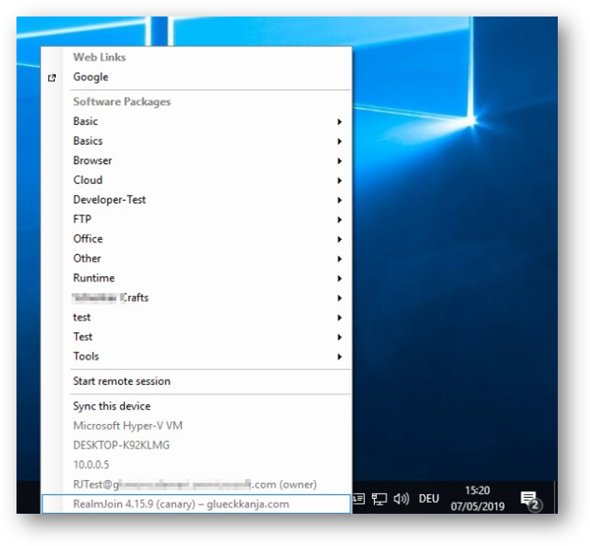

# Managing RealmJoin

Administrative users have access to the RealmJoin administrator console. As RealmJoin is highly compatible with Microsoft Intune and Microsoft Azure, it incorporates the same group based user and policy management experience and uses the Azure AD defined groups as basis for software deployment. The default interval for group synchronization between Azure AD and RealmJoin is 15 minutes, while only groups with a defined prefix are taken into consideration. Only groups with at least one assigned user are synchronized, and the synchronization interval can be adjusted.

## User Client

The RealmJoin client is enrolled on every Windows 10 device. RealmJoin seamlessly fits into the modern workplace with its focus on user self-service and mobility. Using the RealmJoin client module, the user may install provided software, get basic information on the device and membership in the tenant domain without the need of contact an IT administrative.

## Initial Start since RJ v4.15

Since the release of version 4.15, RealmJoin skips the email-based discovery process that user goes through on the sign in page, leading to a slightly more streamlined user experience \(RealmJoin still based on the AAD workflow - AAD sign-in and OAuth-protocol\).


In rare cases it can happen that the user has to enter username and password manually, as a result of failures or incompatible settings.


To see information about the Initial Start before version 4.15, navigate to the [Appendix](appendix.md#Initial-Start-before-RJ-v4.15)

## RealmJoin User Interface and Client menu

### User Interface

RealmJoin uses the **user identity** and checks with it at a Cloud-Service for an **Extended Policy** and optionally for a **Secondary Identity**, then the RealmJoin Security Assessment **checks if the system qualifies** \(Encryption, Patch Level, Firewall, Anti-Virus, etc. - optionally, an Intune-Health-Check may be sufficient\). If the user's device is eligible **software- and configuration-Policy** will be applied \(Mandatory Applications, etc.\).

The following screen shows the RealmJoin toast notification. It appears in the Windows notification center:

This screen shows a customizable **hero image** \(for more information about hero images, click [here](https://docs.microsoft.com/en-us/windows/uwp/design/shell/tiles-and-notifications/adaptive-interactive-toasts#hero-image)\)

Below this hero image you can see information on packages and a comment when the update will start.

You can also see a progress bar and a **Auto Install...** countdown. You have the possibility to snooze the installation or to start the installation now. It depends on a configured deadline how often a user can snooze an installation. When this deadline is over, RealmJoin will automatically install the required updates.

### Client menu

After being successfully installed, RealmJoin is automatically started on the user login and is permanent active in the background. It is represented with an ID card icon. Clicking on the icon opens up the RealmJoin client menu. It contains basic information in the lower and a number of links in the upper part. These links are ordered in two different sections - **Web Links** and **Software Packages**.

Web Links contains customizable web links. For example, Google. When a user click the web link **Google**, RealmJoin will automatically open a Google search in your browser.

Software Packages contains customizable software categories. For example, **Browser** contains links to Mozilla Firefox or Google Chrome. With a click on a link, RealmJoin will automatically start an installation or an updating process.

Furthermore RealmJoin offers a remote function \(**Start remote session**\). For more information about this function in RealmJoin, see [AnyDesk - That's how it works](anydesk.md)

A further useful feature is **Sync this device**.

When you click **Sync this device** RealmJoin will install or update mandatory packages. Furthermore **Sync this device** helps to speed up background processes \(e. g. waiting for new weblinks or waiting for an admin account\).

