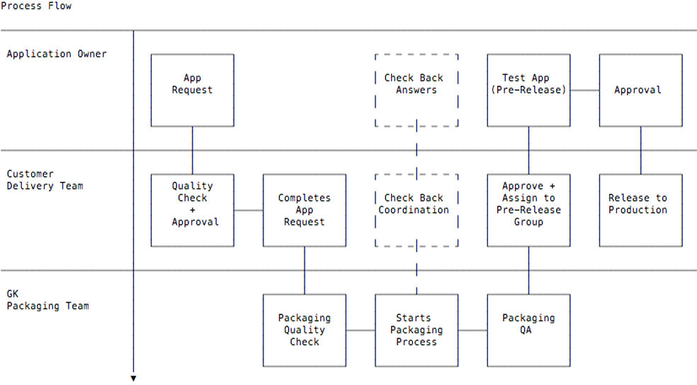

# Package Lifecycle

This section describes the lifecycle of an application package including the updating process.  
Requesting as well as the mechanisms of adding and assigning packages will not be discussed in this section, as those steps are widely explained in chapter [http://docs.realmjoin.com/managing-realmjoin.html\#realmjoin-portal](http://docs.realmjoin.com/managing-realmjoin.html#realmjoin-portal)

## Requesting and initial installation

After subscribing/adding a new package, it is recommended to flag this package as **PreRelease**. This version is then assigned to a test user or test user group \(recommended as non-mandatory\).  
This test users then install the application via RealmJoin in various scenarios.  
If the installation and execution of the application work as planned, it is then assigned to the Application Owner \(AO\) and undergoing the user acceptance test \(UAT\).  
If approved, the PreRelease flag is removed as well as the test group assignment and the application can then be assigned to the users group. This workflow is shown in the pictures below.

## Updating an existing application

The new package version will be added as a PreRelease package to the RealmJoin portal. Depending on the handling of the test users, the next step may vary.

* If the test users are regular accounts that already have the application assigned and installed on the clients, the PreRelease version is to be assigned to those.
* If the test users are dedicated test users, it might be necessary to assign the already rolled out version of the application beforehand and install on the clients to allow correct updating.  

  The test users then install the application on the clients. Because of the PreRelease flag, RealmJoin will recognize the pending update.  

  After the testing, the original application package will be updated and the test users are removed from the PreRelease flagged version. It is possible to leave the PreRelease flagged version in the back-end for further updating and testing.

  If is recommended to test the update manually as well as automated \(mandatory or auto upgrade package\).

