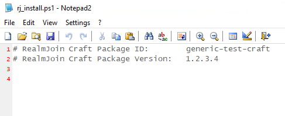
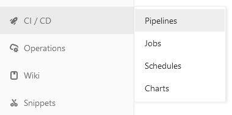

# Craft Package

After the repository creation and preparation of packaging with Jumpstarter this article will show you all necessary steps to edit, customize and deploy a Craft package.

## Edit Package files

Before you can deploy a package to the RealmJoin app store you have to edit your package. The following section will show you how can edit your package files.

### `.gitlab-ci.yml`

The `.gitlab-ci.yml`file contains the build and deploy information. In the **build** stage, the `build-deploy.ps1` helper script is called, while the argument `-build` indicates the **build** stage and `-craft` indicates the package type Craft.  
In the **deploy** stage, the `build-deploy.ps1` helper script is called, while the argument `-deploy` indicates the **deploy** stage and `-craft` indicates the package type Craft.

There are 6 different sample files \(might be already deleted when using the Jumpstarter script and selecting a specific package type\), while those starting with `Sample1*` are considered outdated. Therefore, select and edit the most fitting `Sample0*.gitlab-ci.yml` file and delete the other ones. You might need to adjust the content. Remove the prefix of the filename and save it as `.gitlab-ci.yml`.

### Delete non-craft items

If you did not use the Jumpstarter delete the following files or folders which are not needed in a craft package: `blobs`, `tools`, `usersettings` and `choco-package.nuspec`.

### Customize `rj_install.cmd` and `rj_install.ps1`

You can either use a cmd script or a PowerShell script for the main installation script.

Customize either `rj_install.cmd` or `rj_install.ps1` in the root folder and delete the other one. This file is the main installation script. The first two lines contain the RealmJoin craft package ID and version.



This script may contain various modifications and adjustments, for example editing or creating registry keys. It is also possible to call other scripts or executable files from inside this script.

### Additional Files

Additional files that maybe needed during the installation should also be placed inside the root folder. Examples are .reg, .ini or .exe files.

### Rewrite `Readme.md`

If you have any further information you can write them down in the `Readme.md`, like a short documentation or a internal messages. If you do not need a `Readme.md` you can safely delete it.

### Customize Store Information

For listing the package in the RealmJoin app store four additional files are needed, which should have already been created by using Jumpstarter. If the packages should not be listed in the app store you can safely delete these fours files:

These are the needed files:

* `package-description.md`: Short description of the package.
* `package-icon.png`: The package icon. Must be .png, preferably high-res and quadratic.
* `package-info.json`: Contains information for the app store, mainly categories and package settings \(e. g. `autoUpgrade`, `scope`\)
* `package-technicalhelp.md`: Explanation of possible package installation arguments and further noteworthy information, like package scope setting.

The following screenshot shows a Google Chrome package in the RealmJoin app store \(VLC Player has no Technical Help content, therefore we use Google Chrome in this example.\). You can see the Google Chrome icon \(`package-icon.png`\), a short description about Google Chrome \(`package-description.md`\) and you can further technical information \(`package-technicalhelp.md`\). You do not see `package-info.json` because it works in the background.


## Commit and Upload

Commit your changes and push the project to GitLab.

## Deploy a Package

1. Open the project site in the RealmJoin GitLab with a browser.
2. Navigate to **Pipelines**, which can be found under the **CI / CD** section on the left side.
3. For each commit you will see two stages:
   * The first one, **build**, will start automatically
   * After **build** has finished \(green checkmark\), run the second one, **deploy**. To do that, first click the grey icon next to the green checkmark, then click the play button.




After the successful deployment, the package can be found in the Chocolatey library and can be added to the RealmJoin backend. See chapter [Managing RealmJoin](../managing-realmjoin/) for information on assigning packages.

### Parameters in a Craft Package

To utilize parameters in Craft packages, which have been entered in the optional [args](http://docs.realmjoin.com/managing-realmjoin.html#add-packages) text field, you need to the include the following cmdlets in your `rj_install.ps1` script:

```text
Import-Module (Get-ItemPropertyValue -Path "Registry::HKLM\SOFTWARE\RealmJoin\Variables" -Name RealmjoinCraftSupportModulePath)Import-RealmjoinPackageParameters
```

The RealmJoin Craft extension now parses the argument string and automatically creates and fills the variables with the following pattern:

| Arg name | Variable name |
| :--- | :--- |
| `/Key:xx-yy-zz` | `$packParamKey` \(with value `xx-yy-zz`\) |
| `/Language:EN` | `$packParamLanguage` \(with value `EN`\) |

Those variables may now be used for any purposes within the `rj_install.ps1` script.

