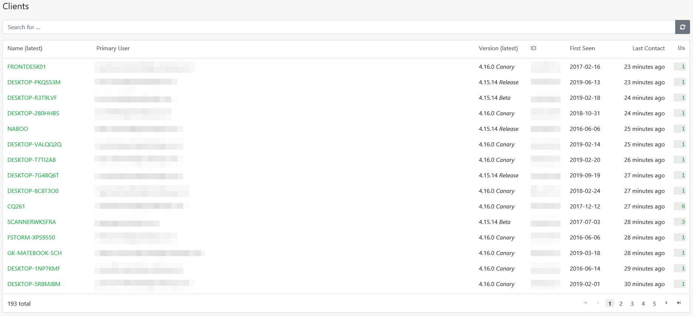
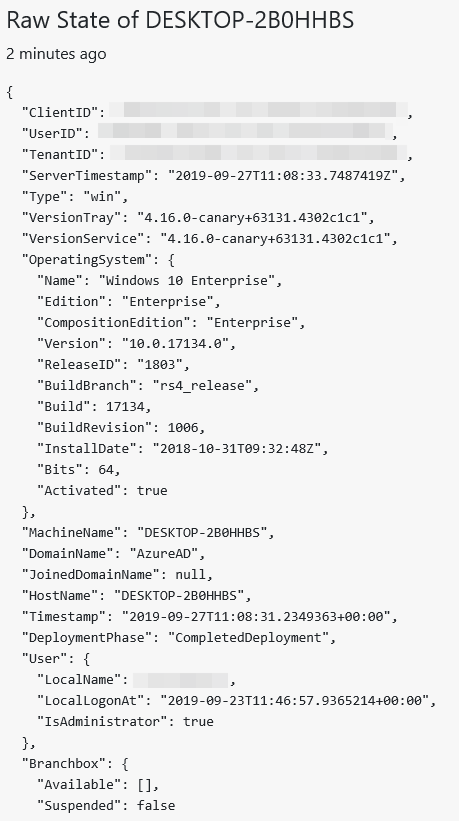

# Clients

This menu gives you a transparent overview over all enrolled devices. Seven different attributes are displayed:

* The latest **Name** of the device.
* The **Primary User**
* The latest RealmJoin **Version**
* An **ID**
* The first registration in RealmJoin \(**First Seen**\)
* The **Last Contact** between the device and RealmJoin
* The number of user accounts using the device \(**Us**\)

Above the attributes there is a search bar \(**Search for ...**\). This search compares the input made with each of the attributes and returns suitable results. At the lower right end of the menu you have the possibility to browse through the pages manually.

### Details

In order to view detailed information about a client and to use other functions of RealmJoin, all you have to do is click on a client name. The following example shows what the opening submenu might look like.

This submenu is divided into different tiles. They all show various information. For example, the device IDs for RealmJoin, Azure and Intune. You will get a brief outline of the device hardware, the primary user, local admin management \([LAPS article]()\), advanced logging, and delivery optimization.

### States

To get a full overview of the latest state of the device, click **Last State** inside the first tile in the upper right corner. The following overview will open:

The shown picture is only a extract. This overview contains many more details about the state of the device. For example, installed software packages, used and integrated hardware, network details, etc.

With the help of this overview it is possible to get an exact view of the used devices and the used software.


It is possible to extend these states by custom states.


